# Architecture - XML Reader

This document describes the high-level architecture of the application, including component relationships, data flow, and key design decisions.

---

## Table of Contents

- [System Overview](#system-overview)
- [Project Structure](#project-structure)
- [Component Tree](#component-tree)
- [IPC Command Map](#ipc-command-map)
- [State Management](#state-management)
- [Search Lifecycle](#search-lifecycle)
- [File I/O Strategy](#file-io-strategy)
- [Navigation Flow](#navigation-flow)
- [Backend Module Structure](#backend-module-structure)

---

## System Overview

The application follows Tauri's split-process architecture: a **Rust backend** handles all file I/O and XML parsing, while a **Svelte 5 frontend** manages the UI and user interactions. Communication between the two happens through Tauri's IPC `invoke` system.

---

## Project Structure

### Directory Responsibilities

| Directory          | Purpose                                            |
| ------------------ | -------------------------------------------------- |
| `src/routes/`      | SvelteKit pages and layout (SPA mode, SSR disabled)|
| `src/lib/`         | Shared state and reusable components               |
| `src/lib/components/` | UI components (DropZone, Header, Viewer)        |
| `src-tauri/src/`   | Rust backend logic (commands + XML operations)     |
| `src-tauri/icons/` | Application icons for all platforms                |
| `doc/`             | Project documentation                              |
| `static/`          | Static assets served by SvelteKit                  |

---

## Component Tree

```mermaid
graph TD
    AppHtml["app.html\n(Shell)"]
    AppHtml --> LayoutSvelte["+layout.svelte\n(CSS import)"]
    LayoutSvelte --> PageSvelte["+page.svelte\n(Router)"]

    PageSvelte -->|"no file open"| LandingView["Landing View"]
    PageSvelte -->|"file open"| ViewerComp["Viewer"]

    subgraph LandingView["Landing View"]
        DropZone["DropZone\n• Drag & drop zone\n• File generation controls\n• Size presets"]
        RecentFiles["Recent Files Panel\n• File list from localStorage\n• Click to open\n• Remove entries"]
    end

    subgraph ViewerComp["Viewer"]
        HeaderComp["Header\n• Home button\n• File name\n• Jump first/last\n• Search bar\n• Cancel button\n• Prev/Next\n• XPath display"]
        ContentArea["Content Area"]
    end

    ContentArea -->|"has active element"| ThreePanel["Three-Panel View"]
    ContentArea -->|"no active element"| SingleChunk["Single Chunk View"]

    subgraph ThreePanel["Three-Panel View"]
        Before["Context Before\n(~2KB, dimmed)"]
        Active["Active Element\n(amber highlight,\npretty-printed)"]
        After["Context After\n(~2KB, dimmed)"]
    end

    Before --> Active --> After

    style PageSvelte fill:#1e1e2e,stroke:#89b4fa,color:#cdd6f4
    style HeaderComp fill:#1e1e2e,stroke:#f9e2af,color:#cdd6f4
    style Active fill:#451a03,stroke:#fbbf24,color:#fbbf24
```

### Routing Logic

The app uses a single page (`+page.svelte`) that conditionally renders based on `appState.currentFile`:

---

## IPC Command Map

All communication between frontend and backend uses Tauri's `invoke()` IPC mechanism. Commands are defined in `xml_ops.rs` and registered in `lib.rs`.

### Command Reference

```mermaid
graph LR
    subgraph Commands["Tauri Commands (7 total)"]
        direction TB
        GenXml["generate_large_xml\n(path, size_mb, depth)"]
        OpenFile["open_file\n(path) → u64"]
        ReadChunk["read_chunk\n(path, offset, size) → String"]
        SearchNode["search_node\n(path, query, start_offset)\n→ SearchResult"]
        CancelSearch["cancel_search\n() → ()"]
        GetFirst["get_first_child\n(path) → SearchResult"]
        GetLast["get_last_child\n(path) → SearchResult"]
    end

    subgraph Categories
        direction TB
        FileIO["📂 File I/O"]
        Search["🔍 Search"]
        Nav["🧭 Navigation"]
        Gen["🏭 Generation"]
    end

    FileIO --- OpenFile
    FileIO --- ReadChunk
    Search --- SearchNode
    Search --- CancelSearch
    Nav --- GetFirst
    Nav --- GetLast
    Gen --- GenXml

    style Commands fill:#1e1e2e,stroke:#6c7086,color:#cdd6f4
```

---

## State Management

The entire application state lives in a single `AppState` class instance (`src/lib/state.svelte.ts`) using Svelte 5 runes for fine-grained reactivity.

### State Flow

---

## Search Lifecycle

The search system supports forward/backward navigation and cooperative cancellation.

### Search Matching Pipeline

```mermaid
graph TD
    Event["XML Event\n(Start or Empty)"]
    Event --> CheckOffset{"offset >= start_offset?"}
    CheckOffset -->|No| Skip["Skip, continue"]
    CheckOffset -->|Yes| MatchTag{"Tag name\ncontains query?"}
    MatchTag -->|Yes| Match["✅ MATCH"]
    MatchTag -->|No| MatchId{"id attr\ncontains query?"}
    MatchId -->|Yes| Match
    MatchId -->|No| MatchGuid{"guid attr\ncontains query?"}
    MatchGuid -->|Yes| Match
    MatchGuid -->|No| MatchName{"name attr\ncontains query?"}
    MatchName -->|Yes| Match
    MatchName -->|No| Skip

    Match --> FindEnd["find_element_end_pos()"]
    FindEnd --> Extract["extract_and_build_result()"]
    Extract --> Result["SearchResult\n{found, xpath, element_text,\ncontext_before, context_after, offset}"]

    style Match fill:#166534,stroke:#22c55e,color:#fff
    style Skip fill:#1e1e2e,stroke:#6c7086,color:#cdd6f4
```

### Cancellation Mechanism

---

## File I/O Strategy

The application **never** loads an entire file into memory. All file access uses offset-based seeking.

### Memory Profile

> The total memory footprint stays well under **1MB** regardless of file size. The largest allocation is the 64KB chunk buffer used by the reverse scanner for `get_last_child`.

---

## Navigation Flow

```mermaid
graph LR
    subgraph User Actions
        JumpFirst["⏮ Jump to First"]
        JumpLast["⏭ Jump to Last"]
        SearchNext["▶ Search Next"]
        SearchPrev["◀ Search Prev"]
        Cancel["✕ Cancel"]
    end

    subgraph Backend Commands
        GetFirst["get_first_child"]
        GetLast["get_last_child"]
        SearchFwd["search_node\n(offset = last + 1)"]
        SearchBwd["search_node\n(offset = 0)"]
        CancelCmd["cancel_search"]
    end

    subgraph View Update
        UpdateView["updateViewFromResult()\n• contentBefore\n• contentActive\n• contentAfter\n• viewOffset\n• currentXpath"]
    end

    JumpFirst --> GetFirst --> UpdateView
    JumpLast --> GetLast --> UpdateView
    SearchNext --> SearchFwd --> UpdateView
    SearchPrev --> SearchBwd --> UpdateView
    Cancel --> CancelCmd

    style UpdateView fill:#1e1e2e,stroke:#a6e3a1,color:#cdd6f4
```

---

## Backend Module Structure

```mermaid
graph TD
    subgraph lib.rs["lib.rs (Entry Point)"]
        TauriBuilder["tauri::Builder\n• Plugin: opener\n• Commands: 7 registered"]
    end

    subgraph xml_ops.rs["xml_ops.rs (Core Module)"]
        subgraph GlobalState["Global State"]
            AtomicFlag["static SEARCH_CANCELLED:\nAtomicBool"]
        end

        subgraph PublicAPI["Public Commands (#[tauri::command])"]
            GenXml["generate_large_xml"]
            OpenFile["open_file"]
            ReadChunk["read_chunk"]
            SearchNode["search_node"]
            CancelSearch["cancel_search"]
            FirstChild["get_first_child"]
            LastChild["get_last_child"]
        end

        subgraph Internals["Internal Functions"]
            GenInternal["generate_xml_internal"]
            WriteNested["write_nested_element"]
            PseudoUUID["pseudo_uuid"]
            ItemName["item_name"]
            ReadChunkInt["read_chunk_internal"]
            SearchInt["search_node_internal"]
            FirstInt["get_first_child_internal"]
            LastInt["get_last_child_internal"]
            ElemMatch["element_matches"]
            FindEnd["find_element_end_pos"]
            ExtractResult["extract_and_build_result"]
            ClassifyTag["classify_tag"]
            ExtractName["extract_tag_name_from_bytes"]
        end

        subgraph DataTypes["Data Types"]
            SearchResult2["SearchResult (struct)"]
            TagKind["TagKind (enum)\n• Open\n• Close\n• Empty"]
        end
    end

    TauriBuilder --> PublicAPI

    GenXml --> GenInternal
    GenInternal --> WriteNested
    WriteNested --> PseudoUUID
    WriteNested --> ItemName

    ReadChunk --> ReadChunkInt
    SearchNode --> SearchInt
    SearchInt --> ElemMatch
    SearchInt --> FindEnd
    SearchInt --> ExtractResult
    SearchNode -.-> AtomicFlag
    CancelSearch -.-> AtomicFlag

    FirstChild --> FirstInt
    FirstInt --> FindEnd
    FirstInt --> ExtractResult

    LastChild --> LastInt
    LastInt --> ClassifyTag
    ClassifyTag --> ExtractName
    LastInt --> ExtractResult

    style GlobalState fill:#451a03,stroke:#fbbf24,color:#fbbf24
    style PublicAPI fill:#1e1e2e,stroke:#89b4fa,color:#cdd6f4
    style Internals fill:#1e1e2e,stroke:#6c7086,color:#cdd6f4
```

---

## Technology Stack

